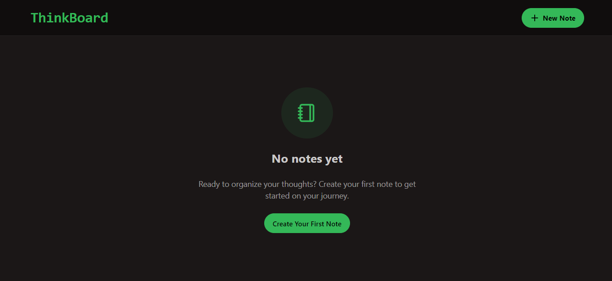
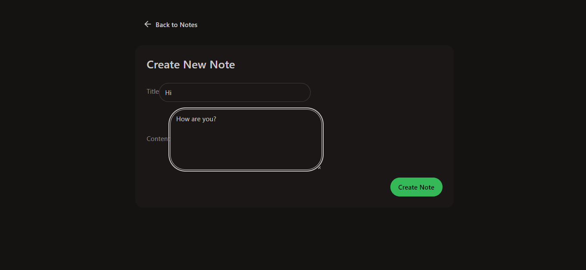
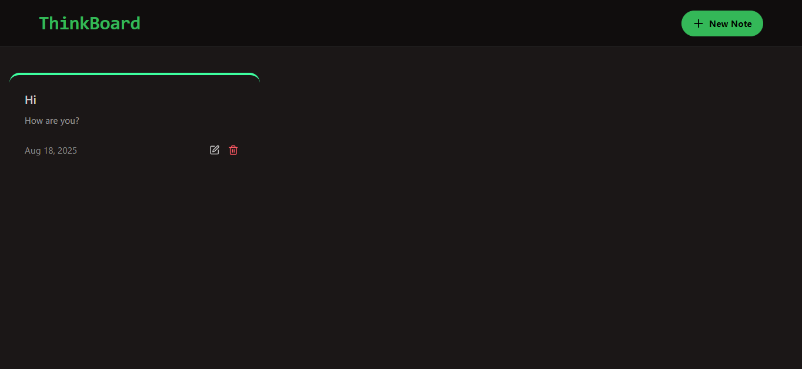
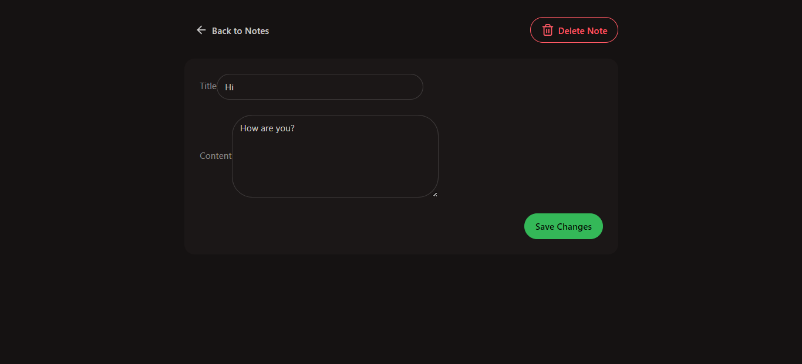
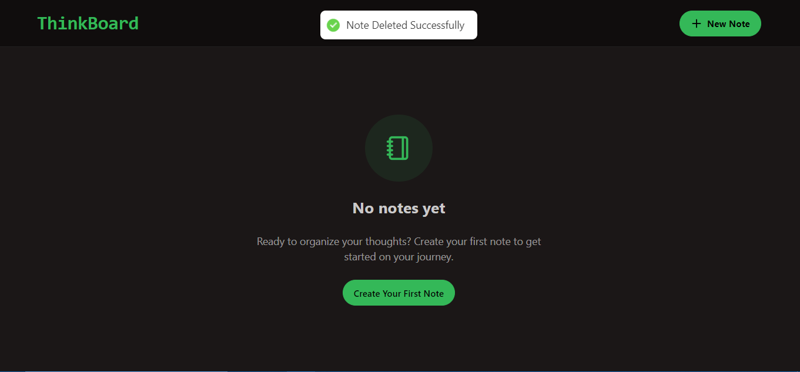

# ThinkBoard 📝

A modern **MERN-based CRUD notes app** with a clean Daisy & Tailwind UI, success or error messages via toast notifications, and Redis-powered rate limiting.

Users can create, edit, and delete notes easily with a clean and responsive interface.

---

## 🚀 Features

- ✨ Create, update, and delete notes
- 🎨 Modern UI built with **React + TailwindCSS + DaisyUI**
- 🔥 Toast notifications
- 🛡️ **Rate limiting** using Upstash Redis
- 🗄️ MongoDB + Mongoose for database
- ⚡ Fast backend powered by Express

---

## 🛠️ Tech Stack

**Frontend**

- React
- TailwindCSS + DaisyUI
- React Router
- React Hot Toast
- Axios

**Backend**

- Node.js + Express
- MongoDB + Mongoose
- Upstash Redis (Rate limiting)
- CORS + Dotenv

---

**Note that [ThinkBoard Frontend](https://github.com/Mudasirh120/ThinkBoard--Mern-Frontend) is also needed along with this.**

## 📦 Installation

### 1. Clone the repositories

```bash
git clone https://github.com/Mudasirh120/Forver--MERN-Backend.git
cd Forver--MERN-Backend
```

### 2. Install Dependencies

```bash
npm install
```

### 3. Add environment variables in .env file

```bash
PORT=5001
MONGODB_URI="your_mongodb_uri"
UPSTASH_REDIS_REST_URL="your_upstash_redis_rest_url"
UPSTASH_REDIS_REST_TOKEN="your_upstash_redis_rest_token"
FRONTEND_URL="thinkboard_frontend_url"
```

### 4. Run the Project

```bash
npm run dev
```

---

### Screenshots






